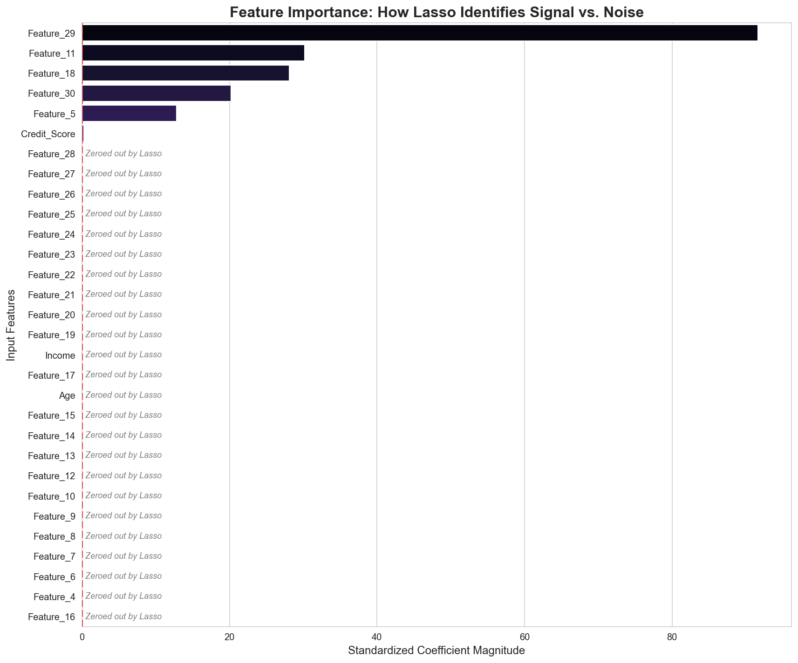

## Executive Summary
The Problem: A high-dimensional financial dataset (30+ features) led to an overfit Linear Regression model that failed to generalize to new customers.
The Solution: Implemented Lasso Regression (L1 Regularized) with Standard Scaling to automate feature selection and reduce model complexity.
** The Result:** Successfully zeroed out 25 non-predictive features, reducing the feature space by 83% while maintaining predictive power and increasing model interpretability for stakeholders.

# Table of contents

- [00. Project Overview](#overview-main)
    - [Context](#overview-context)
    - [Actions](#overview-actions)
    - [Results & Discussion](#overview-results)
- [01. Concept Overview](#concept-overview)
- [02. Data Overview & Preparation](#data-overview)
- [03. Applying Lasso Regression](#lasso-regression-application)
- [04. Analysing The Results](#lasso-regression-results)
- [05. Discussion](#discussion)

___

# Project Overview  <a name="overview-main"></a>

### Context <a name="overview-context"></a>

Our client, a financial services provider, has a dataset containing over 30 customer attributes. They want to predict a specific "Customer Value Score."

However, using a standard Linear Regression model resulted in high variance and poor performance on unseen data. The client needs a model that is not only accurate but robust—meaning it ignores "noise" and focuses only on the most impactful features.

<br>
<br>
### Actions <a name="overview-actions"></a>

We implemented Lasso Regression (L1 Regularization) to address the high dimensionality of the data.

* We applied Standard Scaling to ensure a fair penalty across all features.
* We utilized the L1 Penalty to shrink non-predictive coefficients to zero.
* We visualized the Standardized Coefficients to identify the "Signal" vs the "Noise."

<br>
<br>

### Results & Discussion <a name="overview-results"></a>

The Lasso model successfully reduced the feature space from 30 variables down to 5 high-impact predictors.

By zeroing out 25 "noisy" features, we reduced overfitting and created a much simpler, more interpretable model for the client’s strategy team.

<br>
<br>

___

# Concept Overview  <a name="concept-overview"></a>

<br>
#### Regularization

In Machine Learning, regularization is the process of adding information or a penalty to a model to prevent overfitting.

It discourages the model from learning the training data too closely (memorizing noise).

<br>
#### Lasso Regression (L1)

Lasso (Least Absolute Shrinkage and Selection Operator) is a type of linear regression that uses L1 regularization. It adds a penalty equal to the absolute value of the magnitude of coefficients:

$$Cost = RSS + \lambda \sum_{j=1}^{p} |\beta_j|$$

The unique power of Lasso is that it can force coefficients to exactly zero, effectively performing Automated Feature Selection.

<br>
#### Standard Scaling

Because Lasso penalizes the size of coefficients, features with large raw values (like Income) would be penalized more than features with small values (like Age).

We use Standard Scaling to transform data to a mean of 0 and a standard deviation of 1, putting all features on a level playing field.

<br>

___

<br>
# Data Overview & Preparation  <a name="data-overview"></a>

We utilize a dataset with 30 features. Before modeling, we split the data into training and testing sets and apply standardization.

In the code below, we:

* Load in the Python libraries we require for importing the data
* Import the required data from *customer_data.csv*
* Import StandardScaler() to standardize features

<br>
```python

# install the required python libraries
import pandas as pd
from sklearn.preprocessing import StandardScaler
from sklearn.model_selection import train_test_split

# Load data
df = pd.read_csv('customer_data.csv')
X = df.drop('target', axis=1)
y = df['target']

# Split data
X_train, X_test, y_train, y_test = train_test_split(X, y, test_size=0.2, random_state=42)

# Standardize features
scaler = StandardScaler()
X_train_scaled = scaler.fit_transform(X_train)
X_test_scaled = scaler.transform(X_test)
```
<br>

___

<br>
# Applying Lasso Regression <a name="lasso-regression-application"></a>

We choose a Lambda (alpha) value of 2.0 to apply a moderate penalty to the model.

<br>

```python

from sklearn.linear_model import Lasso

# Initialize and fit the model
lasso = Lasso(alpha=2.0)
lasso.fit(X_train_scaled, y_train)

# Extracting coefficients
feat_importance = pd.DataFrame({
    'Feature': X.columns,
    'Coefficient': lasso.coef_
}).sort_values(by='Coefficient', ascending=False)
```
___

<br>

# Analysing The Results <a name="lasso-standardized-results"></a>

By plotting the coefficients, we can clearly see which features the model deemed important and which ones were discarded.

<div align="center">
  
</div>

```python
import matplotlib.pyplot as plt
import seaborn as sns

# 1. Use a clean, professional style
plt.style.use('fivethirtyeight') # Or 'seaborn-v0_8-whitegrid'

plt.figure(figsize=(10, 8))
# 2. Filter out the zeros so the plot isn't cluttered with 25 empty lines
active_feats = feat_importance[feat_importance['Coefficient'] != 0]

sns.barplot(x='Coefficient', y='Feature', data=active_feats, palette='magma')
plt.axvline(x=0, color='red', linestyle='--')
plt.title('Feature Importance: Lasso Standardized Coefficients', fontsize=16)

# 3. Save it with high resolution for GitHub
plt.savefig('Lasso_standardized_feature_importance.png', dpi=300, bbox_inches='tight')
plt.show()
```
<br>

# Observations

Signal: Features like Age and Income retained significant positive coefficients.

Noise: Over 20 features had their coefficients reduced to 0.0, showing they provided no unique predictive value.

___

from sklearn.metrics import mean_squared_error, r2_score
import numpy as np

# Make predictions
y_pred = lasso.predict(X_test_scaled)

# Calculate Metrics
rmse = np.sqrt(mean_squared_error(y_test, y_pred))
r2 = r2_score(y_test, y_pred)

print(f"Root Mean Squared Error: {rmse:.2f}")
print(f"R-squared Score: {r2:.2f}")

<br>
# Discussion <a name="discussion"></a>

The implementation of Lasso Regression provided a significant upgrade over a baseline Linear Regression.

Avoid Overfitting: By penalizing large coefficients, we ensured the model generalizes better to new customers.

Interpretability: The client can now focus their marketing efforts on the 5 key features identified rather than wasting resources on 30 variables.

Robustness: The model is less sensitive to outliers because the L1 penalty prevents any single feature from having an exaggerated impact on the final prediction.

In conclusion, for high-dimensional datasets where feature importance is unclear, Lasso Regression is an essential tool for building efficient, high-impact machine learning pipelines.
